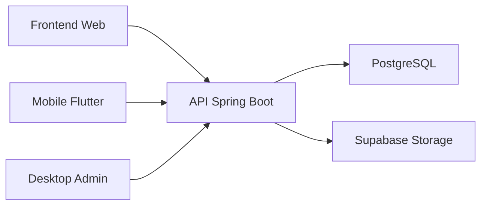

<div align="center">

# CollabResearch Backend

**API principal do sistema de gerenciamento de TCC.**

<p>
  
  
  
</p>

</div>

---

## Visao geral

Backend Spring Boot responsavel por autenticacao, usuarios, projetos, inscricoes, documentos, notificacoes, chat e area administrativa.

## Objetivo

Expor a regra de negocio da plataforma e persistir os dados do sistema para web, mobile e painel administrativo.

## Funcionalidades principais

- Autenticacao e autorizacao por perfil.
- Cadastro e edicao de usuarios.
- Gestao de projetos e inscricoes.
- Upload, consulta e remocao de documentos.
- Notificacoes e conversas.
- Dashboard e rotas administrativas.

## Tecnologias utilizadas

- Java 21
- Spring Boot 4
- Spring Web, Security, Validation e Data JPA
- PostgreSQL
- H2 para testes
- JWT
- Lombok
- Springdoc OpenAPI

## Estrutura do projeto

```text
tcc-backend/
|-- src/main/java/com/example/tcc_backend/
|   |-- controller/   # Endpoints HTTP
|   |-- service/      # Regras de negocio
|   |-- model/        # Entidades JPA
|   |-- repository/   # Acesso a dados
|   |-- dto/          # Requisicoes e respostas
|   |-- config/       # Configuracoes
|   `-- security/     # Autenticacao e autorizacao
|-- src/main/resources/
|-- src/test/         # Testes unitarios e de servico
|-- docs/             # Migrations e documentos auxiliares
|-- Dockerfile
`-- pom.xml
```

## Pre-requisitos

- JDK 21
- Maven Wrapper ou Maven instalado
- PostgreSQL acessivel localmente ou em cloud

## Configuracao de ambiente

Copie e ajuste o arquivo `.env.example` na raiz do backend.

Variaveis principais:

```env
DB_URL=jdbc:postgresql://localhost:5432/tcc
DB_USER=postgres
DB_PASSWORD=postgres
JWT_SECRET=base64_com_pelo_menos_32_bytes
SUPABASE_URL=https://seu-projeto.supabase.co
SUPABASE_ANON_KEY=sua_chave
SUPABASE_STORAGE_BUCKET=documents
```

## Instalacao

```bash
./mvnw clean install
```

No Windows PowerShell:

```powershell
.\mvnw.cmd clean install
```

## Como executar localmente

```bash
./mvnw spring-boot:run
```

No Windows PowerShell:

```powershell
.\mvnw.cmd spring-boot:run
```

## Como gerar build

```bash
./mvnw clean package -DskipTests
```

## Principais rotas

### Autenticacao
- `POST /api/auth/register`
- `POST /api/auth/login`
- `PUT /api/auth/senha`
- `POST /api/auth/logout`

### Usuarios
- `GET /api/usuarios/me`
- `PUT /api/usuarios/me/preferencias`
- `GET /api/usuarios/{id}`
- `GET /api/usuarios/{id}/perfil`
- `PUT /api/usuarios/{id}`
- `GET /api/usuarios/{id}/projetos`
- `GET /api/usuarios/{id}/inscricoes`
- `GET /api/usuarios/{id}/documentos`

### Projetos e inscricoes
- `GET /api/projetos`
- `POST /api/projetos`
- `PUT /api/projetos/{id}`
- `DELETE /api/projetos/{id}`
- `POST /api/projetos/{id}/recrutar`
- `GET /api/inscricoes`
- `POST /api/inscricoes`
- `PUT /api/inscricoes/{id}/aprovar`
- `PUT /api/inscricoes/{id}/rejeitar`

### Chat e notificacoes
- `GET /api/conversas`
- `POST /api/conversas`
- `GET /api/conversas/{id}/mensagens`
- `POST /api/conversas/{id}/mensagem`
- `GET /api/notificacoes`
- `PUT /api/notificacoes/{id}/ler`
- `PUT /api/notificacoes/ler-todas`

### Documentos e dashboard
- `POST /api/documentos/upload`
- `GET /api/documentos/{id}/download`
- `GET /api/documentos/{id}/preview`
- `GET /api/documentos/usuario/{usuarioId}`
- `GET /api/dashboard`

### Admin
- `GET /api/admin/dashboard`
- `GET /api/admin/usuarios`
- `GET /api/admin/projetos`
- `GET /api/admin/inscricoes`
- `GET /api/admin/documentos`
- `GET /api/admin/areas`

## Arquitetura resumida



O backend concentra autenticacao, validacao, regras de negocio e persistencia. Web, mobile e desktop consomem os mesmos contratos HTTP.

## Equipe do projeto

Equipe TCC Backend.

## Licenca

Nao ha arquivo de licenca no repositorio.
